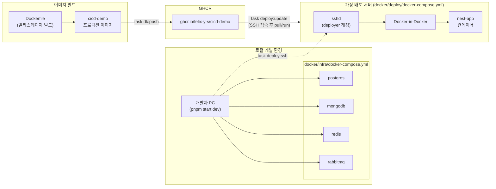

# ci/cd 데모

ci/cd 데모 프로젝트 

## 프로젝트 구조

```
.
├── src/                    # NestJS 애플리케이션 소스
│   ├── modules/            # 도메인 모듈 (auth, users, posts, activity-logs)
│   ├── common/             # 공통 기능 (response-format, exception, pagination, swagger, throttler, logging, events)
│   ├── config/             # 환경설정 (configuration, validation.schema)
│   └── main.ts
├── prisma/                 # Prisma 스키마 및 마이그레이션 (PostgreSQL)
├── Dockerfile              # 애플리케이션 프로덕션 이미지 (멀티스테이지)
├── docker/
│   ├── infra/
│   │   └── docker-compose.yml  # 로컬 개발용 인프라 (postgres, mongodb, redis, rabbitmq)
│   └── deploy/             # 실습용 "가상 배포 서버" 이미지 (SSH + Docker-in-Docker)
│       ├── Dockerfile
│       ├── docker-compose.yml  # local-deploy-server 컨테이너 정의
│       ├── entrypoint.sh
│       └── authorized_keys
├── Taskfile.yml            # 루트 task 정의 (하위 taskfiles를 include)
└── taskfiles/
    ├── docker.yml          # 이미지 빌드/푸시/실행 (dk:*)
    ├── deploy.yml           # 배포 서버 접속/배포 (deploy:*)
    └── db.yml               # DB 마이그레이션 등 (db:*)
```

## docker 시스템 구성도



이 프로젝트는 두 종류의 docker 구성을 가진다.

1. **애플리케이션 이미지** ([Dockerfile](Dockerfile))
   - 4단계 멀티스테이지 빌드: `deps` → `builder` → `prod-deps` → `runtime`
   - 최종 `runtime` 스테이지는 빌드 도구 없이 `node_modules`(prod 전용), `dist`, `prisma`만 포함
   - non-root 사용자(`nestjs`)로 실행, `3000` 포트 노출

2. **로컬 개발 인프라** ([docker/infra/docker-compose.yml](docker/infra/docker-compose.yml))
   - `postgres`, `mongodb`, `redis`, `rabbitmq` 4개 서비스로 구성
   - 각 서비스에 healthcheck 적용, `.env`의 `POSTGRES_*`, `MONGO_*`, `REDIS_*`, `RABBITMQ_*` 값으로 설정

3. **가상 배포 서버** ([docker/deploy/docker-compose.yml](docker/deploy/docker-compose.yml))
   - CI/CD 실습을 위해 "실제 리눅스 서버"를 흉내낸 컨테이너 (SSH + Docker-in-Docker)
   - `deployer` 계정으로 SSH 공개키 인증만 허용, `docker` 그룹 권한 부여
   - 서버는 1대뿐이지만, `docker run` 명령을 길게 늘어뜨리는 대신 compose로 선언적으로 관리 (재현성·유지보수 목적)
   - 이 컨테이너 내부에서 GHCR 이미지를 pull/run하여 실제 배포를 재현 (`task deploy:update`)

## docker image/container 초기화
프로젝트를 도커 이미지 생성 부터 다시 진행할 수 있도록 초기화 한다.

### 애플리케이션 이미지/컨테이너 초기화
```bash
docker rm -f cicd-demo 2>/dev/null                                      # 기존 컨테이너 제거 (task dk:run으로 생성된 경우)
docker rmi -f felix-y-s/cicd-demo:local 2>/dev/null                     # 기존 이미지 삭제
docker build --no-cache -t felix-y-s/cicd-demo:local .                  # 캐시 없이 이미지 재빌드
docker run --rm --name cicd-demo -p 3000:3000 felix-y-s/cicd-demo:local # 컨테이너 재실행
```

### 가상 배포 서버 초기화
```bash
task dk:run:deploy                   # docker/deploy/docker-compose.yml 기준으로 이미지 재빌드 + 컨테이너 재생성
```
내부적으로 다음과 동일하다.
```bash
docker compose -f docker/deploy/docker-compose.yml up -d --build --force-recreate
```
> `local-deploy-server`를 재생성하면 SSH 호스트 키가 바뀌므로, 위 task가 자동으로 `known_hosts`의 기존 항목을 정리한다.

### 로컬 개발 인프라 초기화
```bash
docker compose -f docker/infra/docker-compose.yml down -v   # 컨테이너 + 볼륨(DB 데이터 포함) 삭제
docker compose -f docker/infra/docker-compose.yml up -d     # 재생성
``` 