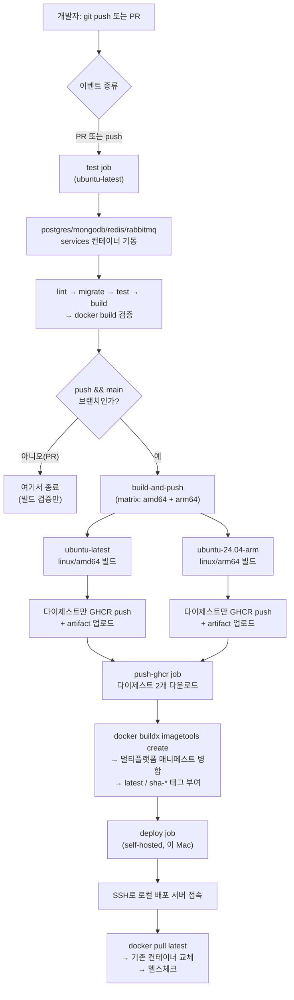
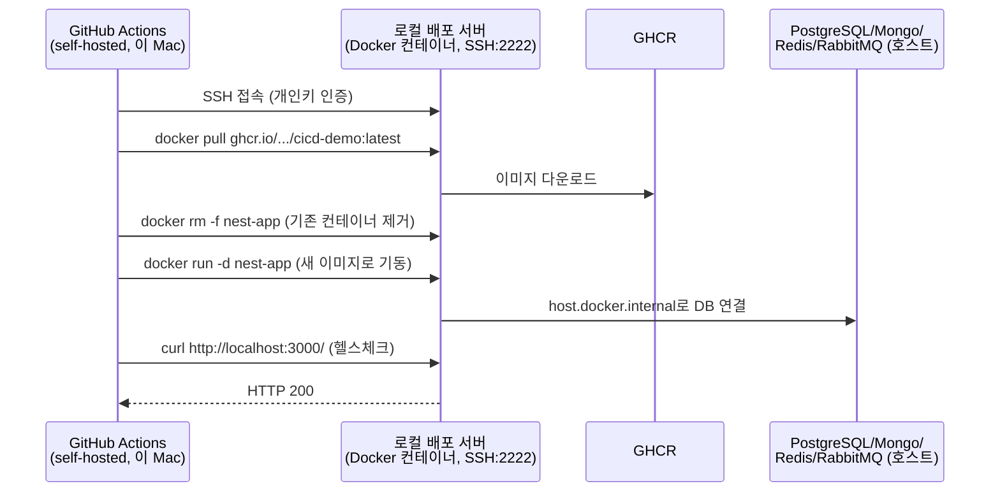

# CI/CD 파이프라인 전체 흐름

`.github/workflows/ci.yml`이 실제로 수행하는 전체 과정을 정리한다.
개별 문법 설명은 [github-actions-syntax-reference.md](./github-actions-syntax-reference.md),
각 단계를 구축하며 겪은 트러블슈팅은 [cicd-learning-log.md](./cicd-learning-log.md)를 참고.

---

## 전체 흐름도



---

## 구간별 설명

### 1. 트리거: `test` job은 항상 실행된다

`main`으로의 push든, `main`을 향한 PR이든 `on:` 조건에 둘 다 걸려 있어
`test` job은 매번 실행된다. 여기서 실제 코드 품질(lint, 테스트, 빌드
가능 여부)을 검증한다. **PR 단계에서 문제를 잡아내는 게 목적**이므로,
이 job에는 배포 관련 로직이 전혀 없다.

### 2. 분기점: PR인가, main push인가

`build-and-push` job에 걸린 조건:
```yaml
if: github.event_name == 'push' && github.ref == 'refs/heads/main'
```
PR에서는 이 조건이 거짓이라 `build-and-push` 이후 모든 job
(`push-ghcr`, `deploy`)이 자동으로 스킵된다. 즉 **PR은 "코드가
문제없는지" 검증만 하고, 실제 이미지 빌드/배포는 main에 merge된 뒤에만
일어난다.**

### 3. 이미지를 왜 두 갈래로 나눠 빌드하는가

처음에는 `platforms: linux/amd64,linux/arm64`를 한 job에서 QEMU로
동시에 에뮬레이션했다. 그런데 이미지 최적화 과정에서 추가한
`pnpm dlx prisma generate`(네이티브 바이너리 실행)가 QEMU 에뮬레이션
환경에서 크래시하는 문제가 발생했다. 그래서 `strategy.matrix`로
amd64/arm64를 **각각 진짜 하드웨어 러너**에서 독립적으로 빌드하도록
바꿨다. 이 저장소가 public이라 GitHub의 네이티브 arm64 러너를 무료로
쓸 수 있었다.

이 구조 때문에 "이미지 빌드"가 3개 job으로 쪼개져 있다:
- `build-and-push` (matrix로 2번 실행) — 각 아키텍처를 따로 빌드해
  **다이제스트만** GHCR에 올린다 (아직 `latest` 태그는 안 붙임).
- `push-ghcr` — 두 다이제스트를 job 아티팩트로 전달받아,
  `docker buildx imagetools create`로 **하나의 멀티플랫폼 매니페스트**로
  합치고 그제서야 `latest`/`sha-*` 태그를 부여한다.

### 4. 왜 배포만 self-hosted runner에서 도는가

`deploy` job만 `runs-on: self-hosted`다. GitHub 클라우드 러너는 인터넷
어딘가에서 실행되므로, 사설 네트워크에 있는 로컬 배포 서버(Mac 위
Docker 컨테이너, SSH 2222번 포트)에 도달할 방법이 없다. 그래서 이
Mac 자체를 GitHub Actions 러너로 등록해, 이 job만 "GitHub이 아니라 내
컴퓨터에서" 실행되게 했다. 그러면 `localhost:2222`로 배포 서버에 바로
SSH 접속할 수 있다.

### 5. 배포 단계가 실제로 하는 일



`main`에 코드가 merge되는 순간부터, 사람이 개입하지 않아도 이 전체
과정이 끝까지 자동으로 이어진다.

---

## 왜 이렇게 설계했는가 (요약)

| 설계 결정 | 이유 |
|---|---|
| test job을 PR/push 둘 다에 건다 | PR 단계에서 문제를 조기에 발견 |
| build-and-push를 main push로 제한 | 검증 안 된 이미지가 GHCR에 쌓이는 것을 방지 |
| matrix로 아키텍처별 독립 빌드 | QEMU 에뮬레이션의 네이티브 바이너리 크래시 회피 |
| 다이제스트만 먼저 push, 태그는 나중에 | 두 아키텍처 빌드가 끝나야 완전한 멀티플랫폼 이미지가 되므로 |
| deploy만 self-hosted | 클라우드 러너가 사설망 배포 서버에 도달 불가능 |
| SSH 개인키를 Secrets로 관리 | 워크플로가 어떤 러너에서 돌든 동일하게 동작(이식성) |
